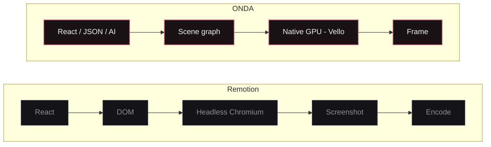
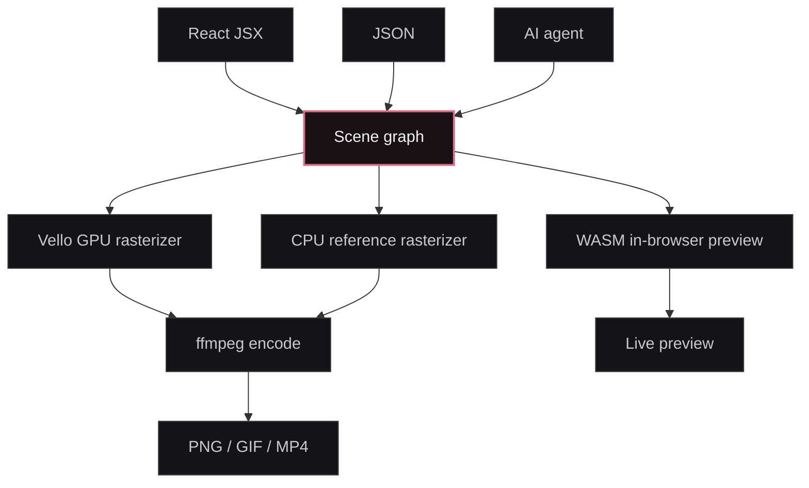

<div align="center">



<br/>

**Author motion graphics in React. Render them natively on the GPU — no headless browser, no Chromium.**

[](#license)
[](#build)
[](#how-it-works)
[](#how-it-works)
[](#status)

[**Website**](https://onda.video) &nbsp;·&nbsp; [Why ONDA](#why-onda) &nbsp;·&nbsp; [Quickstart](#quickstart) &nbsp;·&nbsp; [How it works](#how-it-works) &nbsp;·&nbsp; [Packages](#packages) &nbsp;·&nbsp; [Embedding](#embedding-the-engine)

</div>

---

ONDA turns a **React composition** into a renderer-agnostic **scene graph**, then rasterizes it with a native GPU renderer ([Vello](https://github.com/linebender/vello)) — or a deterministic CPU reference renderer, or a WASM path for live in-browser preview. The scene graph is the universal language; the renderer is the platform.

It's the engine behind **[Onda Studio](https://studio.onda.video)** — an AI motion-graphics studio ("Lovable for video") — but it stands on its own as a programmatic-video toolkit.

> [!NOTE]
> **Pre-1.0.** APIs are unstable and packages are unpublished. The Rust + WASM core is solid (it powers a production studio), but expect breaking changes. ⭐ Star to follow along — the website lands at **[onda.video](https://onda.video)**.

<br/>

## Why ONDA

Programmatic video today (e.g. Remotion) renders by driving a **headless browser**: correct, but heavy — a Chromium per render, slow cold start, high memory, hard to scale. ONDA keeps the **React authoring model** but compiles it to a scene graph and renders it **natively** — there is no browser anywhere in the pipeline.



**It's faster because it does less.** No DOM, no browser process, no screenshot round-trip — just a scene graph straight to the GPU.

> **Measured** (Apple M4 Pro, 1080p, trivial scene — Remotion's best case): ONDA is **~4.5× faster per thread** and **~9.3× higher machine throughput** than Remotion. The gap *widens* with scene complexity, GPU acceleration, cold-start, and memory pressure — the architecture is built to scale toward an order of magnitude and beyond, not to win a microbenchmark.

<br/>

## Quickstart

Author a composition in React/JSX — the same DX as Remotion (`useCurrentFrame`, `interpolate`, `spring`, `<Sequence>`), compiled to a plain scene-graph JSON the engine renders.

```tsx
import { Composition, Rect, Text, linearGradient } from '@onda-engine/react'

export const Hello = () => (
  <Composition width={1920} height={1080} fps={30} durationInFrames={90}>
    <Rect width={1920} height={1080} fill="#0e0e12" />
    <Rect x={160} y={840} width={900} height={12} cornerRadius={6}
      gradient={linearGradient([0, 0], [900, 0],
        [{ offset: 0, color: '#e89aac' }, { offset: 1, color: '#d96b82' }])} />
    <Text x={160} y={420} fontSize={140} color="#f2f2f4">GPU-native</Text>
  </Composition>
)
```

```bash
# render a scene through the GPU (Vello) backend — no browser involved
onda render scene.json out.png
onda export movie.json out.mp4 --backend vello
```

<br/>

## See it

<div align="center">
  
</div>

<br/>

## Features

|  | |
|---|---|
| **GPU-native vector renderer** | Anti-aliased fills & strokes, rounded rects, arbitrary Bézier **paths**, **linear/radial gradients**, **clip masks**, and native **per-glyph vector text** — on [Vello](https://github.com/linebender/vello)/wgpu. |
| **No browser, ever** | Zero Chromium dependency. Deterministic, lower memory, far higher concurrency per machine. Renders in CI or on a small box. |
| **Author in React** | `<Composition>`, `<Rect>/<Path>/<Text>/<Svg>`, `<Sequence>/<Series>/<Loop>`, `useCurrentFrame`, `interpolate`, `spring`. |
| **One scene graph, many targets** | React, JSON, or an AI agent all emit the **same** scene graph. Render it on the GPU, the CPU reference rasterizer, or WASM in the browser. |
| **Deterministic CPU path** | `--backend cpu` gives bit-identical, reproducible output — golden-frame tested in CI. |
| **Import SVG** | `<Svg src=… | markup=…>` expands logos & icons into native vector nodes. |
| **Export anywhere** | PNG · GIF · MP4 via the `onda` CLI (`render` / `export` / `export-frames`). |
| **Batteries: voice, captions, matte** | Optional CLI features bake in Kokoro TTS (`speak`), Whisper transcription (`transcribe`), and U²-Net subject segmentation (`segment`). |

<br/>

## How it works

A custom React reconciler (`@onda-engine/react`) compiles JSX into scene-graph JSON. `@onda-engine/cinema` compiles a higher-level timeline composition (scenes / entries / choreography) into that scene graph. The `onda` CLI (`cli-rs`) rasterizes a scene and encodes it; `@onda-engine/render` is the Node wrapper that drives the CLI for exports.



<br/>

## Packages

**TypeScript** (`packages/`, pnpm workspace)

| Package | What it is |
|---|---|
| `@onda-engine/react` | Custom React reconciler — JSX → scene-graph JSON |
| `@onda-engine/components` | The motion-graphics component & choreography library (titles, kinetic type, gradients, charts, transitions…) |
| `@onda-engine/cinema` | Timeline-composition spec → engine scene compiler (choreography, camera, 2.5D depth, finish) |
| `@onda-engine/render` | Node wrapper that drives the native `onda` CLI to export MP4/PNG |
| `@onda-engine/player` | In-browser preview surface |
| `@onda-engine/wasm` · `@onda-engine/wasm-vello` · `@onda-engine/wasm-audio` | WASM bindings (text metrics, raster, audio) for the browser preview path |

**Rust** (`packages/*-rs`, Cargo workspace)

| Crate | What it is |
|---|---|
| `vello-rs` | GPU rasterizer over Vello/wgpu — plus 3D perspective, glyph extrusion, mesh tessellation |
| `renderer-rs` | CPU reference rasterizer (deterministic, golden-frame tested) |
| `cli-rs` | The `onda` CLI — `render`, `export`, `speak`, `transcribe`, `segment`, lint |
| `typography-rs` · `layout-rs` · `animation-rs` · `vector-rs` · `svg-rs` · `image-rs` | Text shaping, layout, choreography sampling, geometry |
| `scene-rs` · `core-rs` | The scene-graph IR — the contract every layer speaks |
| `audio-rs` · `codecs-rs` · `video-rs` | Audio decode/mix/synth, codec glue, native A-roll decode (shells to `ffmpeg`) |
| `tts-rs` · `transcribe-rs` · `segment-rs` | Kokoro voiceover, Whisper transcription, U²-Net subject segmentation (ONNX) |

<br/>

## Build

**Toolchain:** `pnpm 10`, Rust (`cargo`), and — for the `speak` / `transcribe` / `segment` CLI features — `cmake`, `clang`, and `espeak-ng`. `ffmpeg` is needed **at runtime** for video encode/decode.

```bash
pnpm install
pnpm -r build          # build all TypeScript packages

# native CLI (full feature set)
cargo build --release -p onda-cli --features segment,video,transcribe,speak

# render a scene
./target/release/onda render examples/hello-onda.json out.png --backend vello
```

> ML model weights (Whisper ~142 MB, Kokoro ~325 MB, U²-Net ~176 MB) are **not** bundled — they download once at first use to `~/.onda/models/`.

<br/>

## Embedding the engine

Downstream apps don't install these packages from a registry — they consume a prebuilt **embed kit**: a single bundled JS entry (`onda-engine.js`, with the TS packages inlined) plus the native `onda` binary, WASM, and fonts. Build it locally, or grab a tagged linux release:

```bash
scripts/build-embed-kit.sh                 # → dist/embed-kit/  (this platform)
scripts/build-embed-kit.sh --skip-binary   # JS/d.ts/wasm only (no cargo build)
```

The CI **[Release workflow](.github/workflows/release.yml)** builds a linux `x86_64` embed kit on every `v*` tag, smoke-tests it on headless Vulkan (lavapipe), and attaches the tarball to a **[GitHub Release](https://github.com/onda-engine/onda-engine/releases)**. Drop the output into the host app and import it by path — **no Rust toolchain or engine source required on the deploy side.**

<br/>

## Status

Pre-1.0 — the engine powers a production studio, but the public API isn't frozen and nothing is on npm yet. See **[PUBLISHING.md](PUBLISHING.md)** for the (deliberately deferred) release flow.

- **Quality gates:** CI runs Rust `fmt`/`clippy`/tests + a golden-frame determinism harness, the TS build + Biome, and a headless-Linux **render smoke test** (Vello on lavapipe) — proving server-side rendering on every change.
- **Roadmap:** published `@onda-engine/*` packages · multi-platform embed kits (macOS / Windows) · richer 3D · docs site at [onda.video](https://onda.video).

<br/>

## License

Source-available under the **[Functional Source License](LICENSE)** (FSL-1.1-Apache-2.0): read, run, self-host, modify, and build non-competing products freely — the one restriction is shipping a competing product. Each release converts to **[Apache-2.0](LICENSE-APACHE)** two years after it ships. Third-party notices are in **[NOTICE.md](NOTICE.md)**.

<br/>

<div align="center">
  
  <br/><br/>
  <sub><b>ONDA</b> &nbsp;·&nbsp; Motion graphics at GPU speed &nbsp;·&nbsp; <a href="https://onda.video">onda.video</a></sub>
</div>
